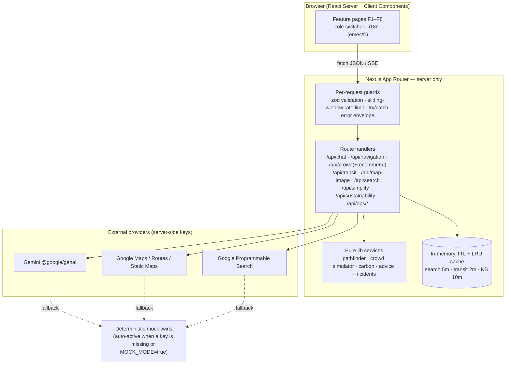

# ArenaPulse

**A GenAI-enabled stadium operations and fan-experience platform for the FIFA World Cup 2026** — one Next.js app that helps fans, volunteers, organizers, and venue staff with navigation, crowd management, accessibility, transportation, sustainability, multilingual assistance, operational intelligence, and real-time decision support.

> _Independent hackathon project. Not affiliated with or endorsed by FIFA._

---

## Problem statement

> "Build a GenAI-enabled solution that enhances stadium operations and the overall tournament experience for fans, organizers, volunteers, or venue staff. The solution must leverage Generative AI to improve navigation, crowd management, accessibility, transportation, sustainability, multilingual assistance, operational intelligence, or real-time decision support during the FIFA World Cup 2026."

Every one of the eight capability keywords is a named, working feature, visible in the UI and mapped below.

---

## Capability keyword → feature → route → source

| Capability keyword          | Feature                               | Route                | Primary source file(s)                                                                |
| --------------------------- | ------------------------------------- | -------------------- | ------------------------------------------------------------------------------------- |
| Multilingual assistance     | F1 · Multilingual Match-Day Assistant | `/assistant`         | `src/lib/ai/gemini.ts`, `src/app/api/chat/route.ts`, `src/lib/ai/chat-stream.ts`      |
| Navigation                  | F2 · Smart Stadium Navigation         | `/navigation`        | `src/lib/navigation/pathfinder.ts`, `src/app/api/navigation/route.ts`                 |
| Crowd management            | F3 · Crowd Intelligence & Heatmap     | `/crowd`             | `src/lib/crowd/simulator.ts`, `src/app/api/crowd/route.ts`                            |
| Real-time decision support  | F3 / F7 · Crowd + Ops recommendations | `/crowd`, `/ops`     | `src/app/api/crowd/recommend/route.ts`, `src/app/api/ops/briefing/route.ts`           |
| Accessibility               | F4 · Accessibility Companion          | `/access`            | `src/components/features/access-companion.tsx`, `src/app/api/simplify/route.ts`       |
| Transportation              | F5 · Transit & Parking Planner        | `/transit`           | `src/lib/google/maps.ts`, `src/lib/transit/advice.ts`, `src/app/api/transit/route.ts` |
| Sustainability              | F6 · Sustainability Hub               | `/sustainability`    | `src/lib/sustainability/carbon.ts`, `src/app/api/sustainability/route.ts`             |
| Operational intelligence    | F7 · Ops Command Center               | `/ops`               | `src/lib/ops/incidents.ts`, `src/app/api/ops/briefing/route.ts`                       |
| Real-time decision support¹ | F8 · Grounded Live Info (embedded)    | `/assistant`, `/ops` | `src/lib/google/search.ts`, `src/app/api/search/route.ts`                             |

¹ F8 grounds F1/F7 answers with cited web results via the Google Programmable Search API.

---

## Audience / role coverage

A header **role switcher** toggles the experience (persisted in the URL as `?role=`). No auth required.

| Role                  | What they get                                                                                                        |
| --------------------- | -------------------------------------------------------------------------------------------------------------------- |
| **Fan**               | Multilingual assistant, navigation, transit, sustainability, accessibility companion, read-only crowd/ops summaries. |
| **Volunteer**         | Everything above plus a filtered, simplified Ops view (open incidents, briefing headline & key points).              |
| **Organizer / Staff** | Full Ops Command Center (log incidents, full briefing), crowd AI recommendations, all fan/volunteer features.        |

The UI language switcher (English / Español / Français) updates `<html lang>`; the AI assistant additionally answers in Arabic, Portuguese, and Hindi.

---

## Feature tour

| Feature                                                                                                                | Screenshot                 |
| ---------------------------------------------------------------------------------------------------------------------- | -------------------------- |
| F1 Multilingual Match-Day Assistant — streaming multilingual chat over a stadium knowledge base, with cited live info. | _(screenshot placeholder)_ |
| F2 Smart Stadium Navigation — SVG map + BFS/Dijkstra route, step-free option, natural-language turn-by-turn.           | _(screenshot placeholder)_ |
| F3 Crowd Intelligence & Heatmap — simulated per-zone density with pattern+text encoding and AI recommendations.        | _(screenshot placeholder)_ |
| F4 Accessibility Companion — accessible-services directory + plain-language announcement rewriter.                     | _(screenshot placeholder)_ |
| F5 Transit & Parking Planner — journey plan, smart leave-by time, proxied static map.                                  | _(screenshot placeholder)_ |
| F6 Sustainability Hub — travel-mode carbon comparison + personalized tip.                                              | _(screenshot placeholder)_ |
| F7 Ops Command Center — KPI tiles, incident log, structured shift briefing.                                            | _(screenshot placeholder)_ |
| F8 Grounded Live Info — cited search results with retrieval timestamps, embedded in F1/F7.                             | _(screenshot placeholder)_ |

---

## Architecture



Layering is strict: `app/` (routing + thin handlers) → `components/` (presentational) → `lib/` (all logic and services) → `schemas/` (zod) → `data/` (fixtures). See [`docs/ARCHITECTURE.md`](docs/ARCHITECTURE.md) for module responsibilities and the lifecycle of a single chat message.

---

## Tech stack & rationale

- **Next.js (App Router) + TypeScript `strict`** — a single deployable that keeps every API key server-side; Server Components by default, `"use client"` only where interactivity demands it.
- **`@google/genai`** — Gemini for chat, structured recommendations, briefings, narration, and tips (server-only).
- **Google Maps & Programmable Search** — transportation planning and grounded live info, both proxied server-side.
- **Zod** — one runtime-validation layer for env, requests, responses, and untrusted AI JSON; types are derived with `z.infer` so shapes are never duplicated.
- **Tailwind CSS v4** + small hand-rolled accessible components (Button, Card, Tabs, Dialog, Skeleton) — no heavy UI kit, lean bundle.
- **Vitest + Testing Library + vitest-axe** — unit, integration, component, and accessibility tests.
- **No database, no auth** — in-memory stores and JSON fixtures make the demo deterministic and runnable by judges with zero infrastructure. State is per-process and resets on restart (see Limitations).

---

## Quick start (works with zero keys)

Requires **Node ≥ 20.9** (see `.nvmrc`).

```bash
npm install
npm run dev
# open http://localhost:3000
```

With no `.env` at all, every external service runs against its deterministic **mock twin** and a "Demo mode (mock data)" badge appears where mocks are used. Add real keys to go live — each service switches on independently as soon as its key is present.

### Environment variables

Copy `.env.example` to `.env` and fill in what you have. All variables are optional.

| Variable                | Purpose                                       | Required?          |
| ----------------------- | --------------------------------------------- | ------------------ |
| `GEMINI_API_KEY`        | Gemini calls (server only)                    | No — mock fallback |
| `GEMINI_MODEL`          | Model id (default `gemini-2.5-flash`)         | No                 |
| `GOOGLE_MAPS_API_KEY`   | Directions/Routes + Static Maps (server only) | No — mock fallback |
| `GOOGLE_SEARCH_API_KEY` | Custom Search JSON API (server only)          | No — mock fallback |
| `GOOGLE_SEARCH_CX`      | Programmable Search engine id                 | No                 |
| `MOCK_MODE`             | `true` forces mocks even if keys exist        | No                 |

Secrets are read **only** in `src/lib/env.ts`, never exposed via `NEXT_PUBLIC_*`, and never logged.

---

## Scripts

| Script                  | Description                                 |
| ----------------------- | ------------------------------------------- |
| `npm run dev`           | Start the dev server                        |
| `npm run build`         | Production build                            |
| `npm run start`         | Serve the production build                  |
| `npm run lint`          | ESLint (strict, `--max-warnings 0`)         |
| `npm run typecheck`     | `tsc --noEmit`                              |
| `npm run format`        | Prettier write                              |
| `npm run format:check`  | Prettier check                              |
| `npm run test`          | Run the test suite once                     |
| `npm run test:watch`    | Watch mode                                  |
| `npm run test:coverage` | Run tests with coverage thresholds enforced |

---

## Testing & coverage

- **221 tests** across unit (schemas, env, pathfinder, simulator, cache, rate limiter, carbon, prompts, AI JSON parsing), integration (every API route: happy path, validation 400s, rate-limit 429s, mock-mode), component (role/language switchers, streaming chat, navigation, ops briefing, every feature screen), and **axe accessibility scans** (zero violations on Home, Assistant, Navigation, Crowd, Ops, and more).
- Tests never touch the network — Gemini/Maps/Search are exercised through their mock twins or an injected `fetch`.
- Coverage thresholds are enforced in `vitest.config.ts`: **≥ 85 % statements/lines for `src/lib` and `src/app/api`**, ≥ 70 % overall. Latest run: ~88 % statements / ~88 % lines overall.

```bash
npm run test:coverage
```

---

## Security overview

- All Gemini/Maps/Search calls run **only** in server route handlers; no key can reach the client bundle.
- **Zod `.strict()` validation** on every route input, with length caps (chat ≤ 2,000 chars, history ≤ 20 turns); invalid input returns a generic `400`.
- **Sliding-window rate limiting** keyed by client IP — 20 req/min for AI routes, 60 req/min otherwise, returning `429` + `Retry-After`.
- **Strict security headers** in `next.config.ts` (CSP, `X-Frame-Options: DENY`, `X-Content-Type-Options`, `Referrer-Policy`, `Permissions-Policy`, HSTS). Because map images are proxied through `/api/map-image`, `img-src` stays `'self' data:`.
- **AI output is untrusted**: rendered as sanitized markdown (no `dangerouslySetInnerHTML` anywhere); structured output is zod-validated with one retry then a graceful fallback.
- **Prompt-injection defenses**: system prompts scope the model to venue/tournament topics; user text and search snippets are wrapped in labeled delimiters and treated as data; output tokens are capped.
- Outbound calls have a 15 s `AbortController` timeout. Errors are logged as safe metadata only — never stack traces, key material, or PII.

Full details and the threat model are in [`SECURITY.md`](SECURITY.md).

---

## Accessibility statement

ArenaPulse targets **WCAG 2.1 AA**. Semantic landmarks, exactly one `h1` per page, a skip-to-content link, full keyboard operability (visible focus rings, dialog focus trap + Escape, roving-focus tabs), `aria-live` regions for streamed chat and crowd/briefing updates, labeled controls, ≥ 44 px touch targets, `prefers-reduced-motion` support, and `<html lang>` synced to the UI language. Density and status are encoded with **pattern + text, never color alone**.

Testing method: automated `vitest-axe` scans on the key screens (zero violations) plus a manual keyboard-only pass. Color contrast was verified manually against AA ratios, since axe cannot compute rendered contrast in the jsdom test environment; full conformance still warrants review with assistive technologies.

---

## Sustainability note

Beyond the F6 Sustainability Hub, the app itself is built to be lean: Server Components by default, streamed responses, dynamic imports for the SVG map/heatmap, in-memory caching to cut repeat upstream calls, and a dependency tree deliberately kept small (native `fetch`/`Intl`, no lodash/moment/axios).

---

## Limitations & honest disclosure

- **Crowd data is simulated.** The per-zone density feed comes from a deterministic seeded simulator (`src/lib/crowd/simulator.ts`) and is labeled "Simulated feed for demo purposes." throughout the UI — it is not real telemetry.
- In-memory stores (incidents, caches, rate-limit windows) are **per-process** and reset on restart; in a serverless deployment each instance keeps its own state. Production would back these with a shared store.
- Emission factors in the Sustainability Hub are illustrative averages, disclosed in the returned note.
- The venue map, schedule, and knowledge base are demo fixtures for a fictional stadium.

---

## Disclaimer

Independent hackathon project. **Not affiliated with or endorsed by FIFA.** No FIFA logos, crests, or trademarked assets are used.

---

## License

[MIT](LICENSE) © ArenaPulse contributors.
